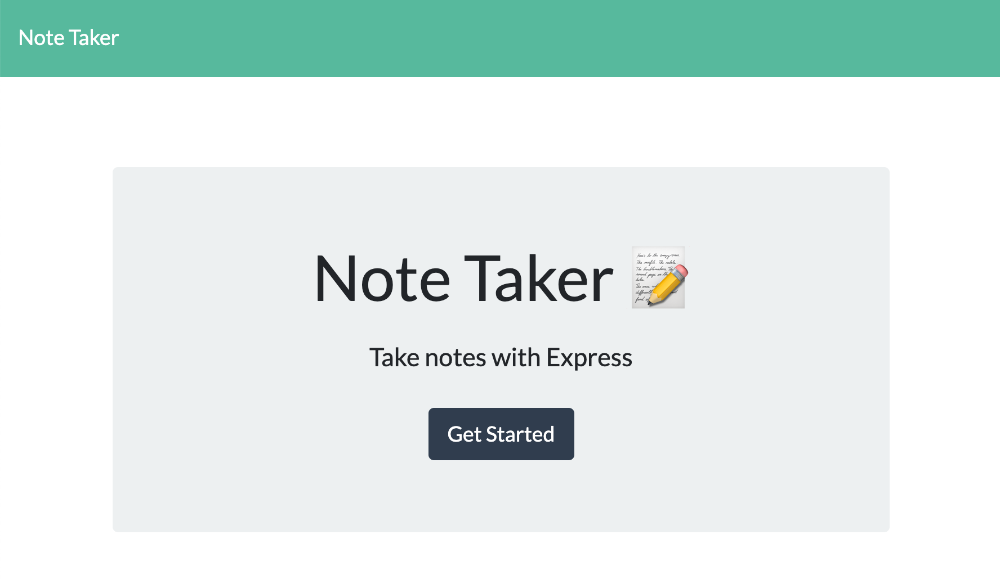

# The Expressive Note Taker

## Description

A simple note taking application created using the Express framework for Node.js.

## Installation

You can use the Expressive Note Taker here: https://hidden-bastion-28546.herokuapp.com/

## Usage

Click Get Started to begin.  Then add your first notes title and text.  When you're done hit the save icon. A list of all previous notes will appear on the left. Simply click them to view them, or click the delete icon to delete them.

## Questions?

For any further questions, you can find my github profile here: https://github.com/MrSumada